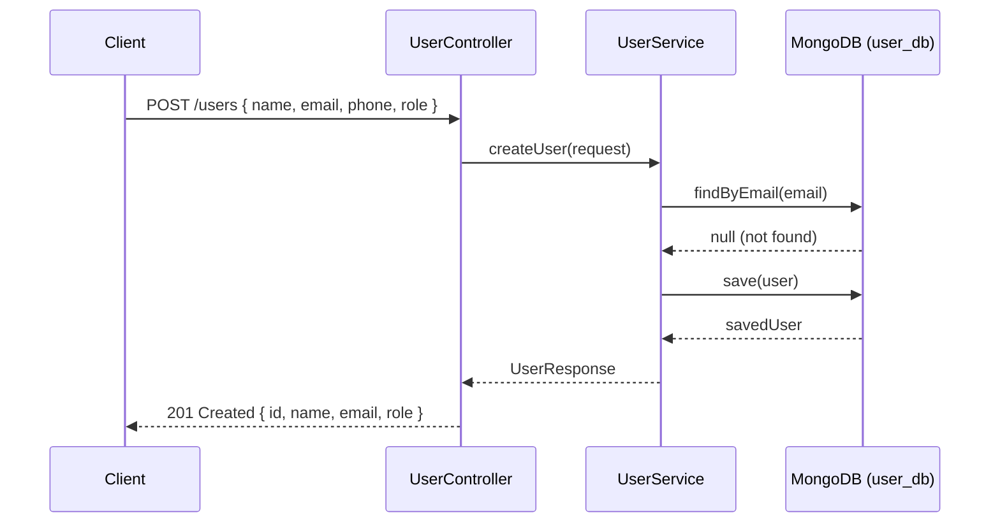
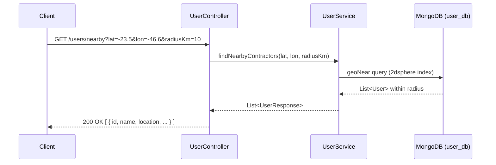
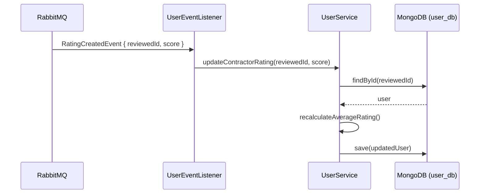
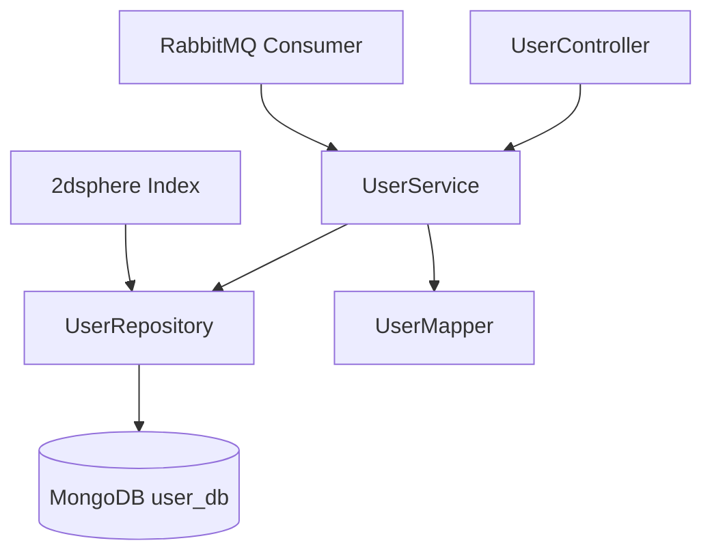

# 👤 User Service

Microservice responsible for managing user profiles (clients and contractors) in the Clean Pro Solutions platform. Supports geospatial search for nearby contractors using MongoDB 2dsphere index.

---

## 📋 Service Info

| Property     | Value                                         |
|--------------|-----------------------------------------------|
| Port         | `8082`                                        |
| Database     | MongoDB — `user_db`                           |
| RabbitMQ     | Consumer (`RatingCreatedEvent`)               |
| Registry     | Eureka (`user-service`)                       |

---

## 🔄 Main Flow — Sequence Diagrams

### User Creation Flow



### Nearby Contractor Search Flow



### Rating Update Flow (Event Consumer)



---

## 🏗️ Internal Architecture



---

## 📡 API Endpoints

| Method | Path                           | Request Body / Params                          | Response                             |
|--------|--------------------------------|------------------------------------------------|--------------------------------------|
| POST   | `/users`                       | `{ name, email, phone, role }`                 | `201 { id, name, email, role }`      |
| GET    | `/users/{id}`                  | —                                              | `200 UserResponse`                   |
| GET    | `/users/email/{email}`         | —                                              | `200 UserResponse`                   |
| PUT    | `/users/{id}`                  | `{ name, phone, ... }`                         | `200 UserResponse`                   |
| DELETE | `/users/{id}`                  | —                                              | `204 No Content`                     |
| PUT    | `/users/{id}/contractor-profile` | `{ specialties, hourlyRate, bio }`           | `200 UserResponse`                   |
| POST   | `/users/{id}/device-tokens`    | `{ token, platform }`                          | `200 UserResponse`                   |
| GET    | `/users/nearby`                | `?lat=X&lon=Y&radiusKm=Z`                      | `200 [ UserResponse ]`               |

---

## ⚙️ Environment Variables

| Variable                    | Description                  | Default                                |
|-----------------------------|------------------------------|----------------------------------------|
| `SPRING_DATA_MONGODB_URI`   | MongoDB connection URI       | `mongodb://localhost:27017/user_db`    |
| `RABBITMQ_HOST`             | RabbitMQ host                | `localhost`                            |
| `RABBITMQ_PORT`             | RabbitMQ port                | `5672`                                 |
| `EUREKA_SERVER_URL`         | Eureka registry URL          | `http://localhost:8761/eureka`         |

---

## 🚀 Build & Run

### Build
```bash
mvn clean install
```

### Run locally
```bash
mvn spring-boot:run
```

### Run with Docker Compose
```bash
docker-compose up user-service
```

---

## 🧪 How to Test

### Create a user
```bash
curl -X POST http://localhost:8082/users \
  -H "Content-Type: application/json" \
  -d '{
    "name": "João Silva",
    "email": "joao@exemplo.com",
    "phone": "11999990000",
    "role": "CLIENT"
  }'
```

### Get user by ID
```bash
curl http://localhost:8082/users/64a1b2c3d4e5f6a7b8c9d0e1
```

### Update contractor profile
```bash
curl -X PUT http://localhost:8082/users/64a1b2c3d4e5f6a7b8c9d0e1/contractor-profile \
  -H "Content-Type: application/json" \
  -d '{
    "specialties": ["RESIDENTIAL", "COMMERCIAL"],
    "hourlyRate": 80.00,
    "bio": "10 years of experience"
  }'
```

### Find nearby contractors
```bash
curl "http://localhost:8082/users/nearby?lat=-23.5505&lon=-46.6333&radiusKm=15"
```

---

## 🗂️ Project Structure

```
clean-pro-solutions-user-service/
├── src/main/java/
│   └── com/cleanpro/user/
│       ├── controller/     # REST endpoints
│       ├── service/        # Business logic
│       ├── repository/     # MongoDB repositories (2dsphere)
│       ├── dto/            # Request/Response records
│       ├── model/          # User entity
│       ├── mapper/         # Entity <-> DTO mapping
│       ├── config/         # RabbitMQ config
│       └── exception/      # Custom exceptions
├── src/test/
└── pom.xml
```
